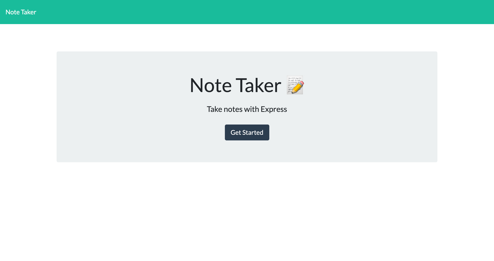

# My Note Taker
  
  

  
  ## Description 
  This is node.js based note taking application that can be used to write, save and delete notes. The application uses express.js as the backend and is deployed to heroku.

  > Production URL: https://intense-beach-16084.herokuapp.com/

  ## Table of Contents
  * [Installation](#installation)
  * [Usage](#usage)
  * [License](#license)
  * [Contributing](#contributing)
  * [Tests](#tests)
  * [Screenshots](#screenshots)
  * [Questions](#questions)
  
  ## Installation 
  To install the app, one needs to clone the application from the GitHub repository and then install the required packages, e.g. npm init, npm install. Once all the dependencies are installed, then "npm start" command needs to be run on the CLI.

  ## Usage 
  An user can use the application by directly browing the prodcution URL.

  ## License
   

  ## Contributing 
  This is an open source application, meaning anybody can fork the repo and make improvement recommendations by submitting their pull requests.

  ## Tests
  The application is tested for errors and does not need any further testing at this stage.

  ## Screenshots
  
  

  ## Questions
  If you have any questions about this projects, please feel free to contact me directly.

  > ### Cyprian Gomes
  > #### email: cyprian.gomes@live.co.uk

  You can view more of my projects at https://github.com/capg84.
